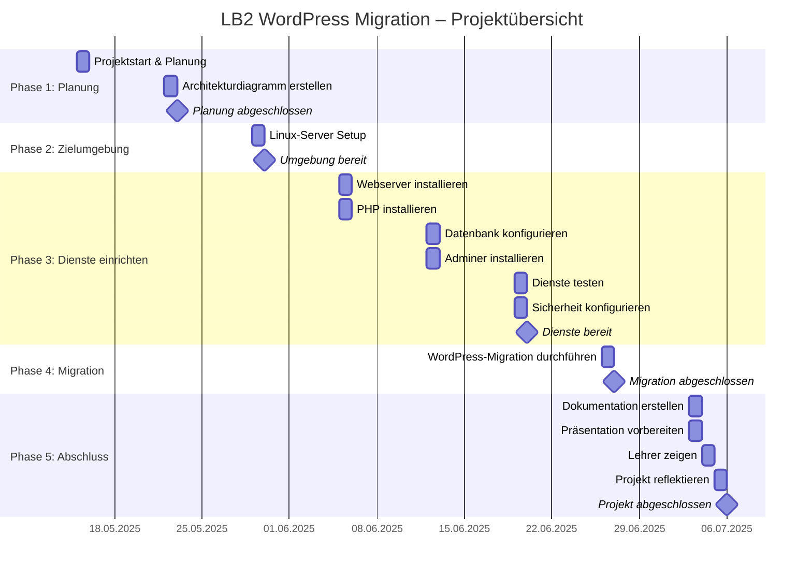

# Dokumentation LB2

## Projektplanung – LB2 WordPress Migration

In diesem Abschnitt habe ich einen Projektplan für meine WordPress-Migration erstellt. Der Plan zeigt alle wichtigen Aufgaben, die ich in den verschiedenen Phasen erledigen muss – von der Planung über das Einrichten der Server bis hin zur Migration und dem Abschluss.

Der Projektplan ist als Gantt-Diagramm mit Mermaid dargestellt. So kann ich die Aufgaben übersichtlich nach Datum und Phase darstellen.

Hier ist mein Projektplan zu den oben genannten Themen:

### Mein Architekturdiagramm finden sie hochgeladene datei als draw.io file.

## Hier sehen sie screenshots meiner umgebung die ich aufgebaut habe

Hier sieht man meine Server

Diese Server laufen in diesem VPC.

Hier sieht man das Subnetz das ich erstellt habe.

Hier sieht man die Sicherheitsgruppe die ich erstellt habe. Ich habe die ganze umgebung wie in meinem Architekturdiagramm aufgebaut die Ip Addresen stimmen auch. Dan habe ich mir noch 3 éffentliche Ips gemacht damit ich auf meine Instnazen komme mit ssh.
## Hier sieht man mein Wordpress dashboard und die Login Daten

## Hier sieht man mein phpinfo.php im Browser meines lokalen Notebooks

Gelb Markiert sieht man die einträge die ich geändert habe.

Mein passwort für den Root user ist TBZ12345!
