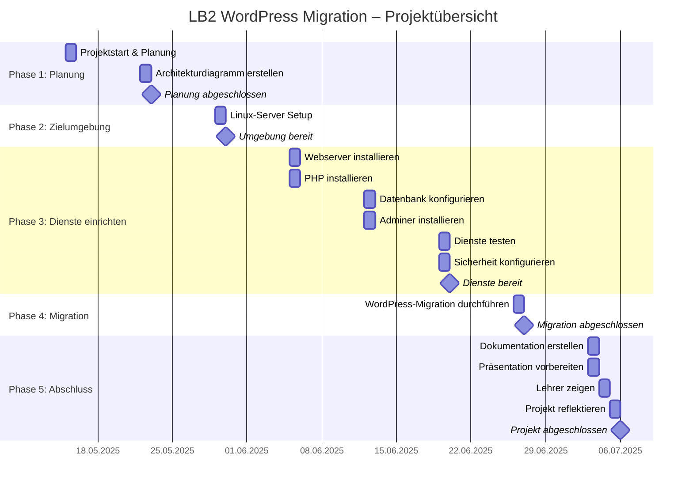

# Projektdokumentation – M158 LB2  WordPress-Migration

## Übersicht
# Projektdokumentation – Webserver-Projekt

Diese Dokumentation ist nach den Aufgaben (1–14) gegliedert. Jede Aufgabe ist in drei Phasen unterteilt. Bitte tragen Sie Ihre Ergebnisse jeweils unter den entsprechenden Abschnitten ein.

---

## Aufgabe 1 – Projektplan erstellen

### Stufe 1 - 3

In diesem Abschnitt habe ich einen Projektplan für meine WordPress-Migration erstellt. Der Plan zeigt alle wichtigen Aufgaben, die ich in den verschiedenen Phasen erledigen muss – von der Planung über das Einrichten der Server bis hin zur Migration und dem Abschluss.

Der Projektplan ist als Gantt-Diagramm mit Mermaid dargestellt. So kann ich die Aufgaben übersichtlich nach Datum und Phase darstellen.

Hier ist mein Projektplan zu den oben genannten Themen:

---

## Aufgabe 2 – Architekturdiagramm erstellen

### Stufe 1 - 3

Mein Architektur diagramm habe ich als datei in diesem Ordner gespeichert damit man eine Bessere sicht hat weil es sehr gross geworden ist.

---

## Aufgabe 3 – AWS-Umgebung einrichten

### Stufe 2

Hier sieht man meine Server

Diese Server laufen in diesem VPC.

Hier sieht man das Subnetz das ich erstellt habe.

Hier sieht man die Sicherheitsgruppe die ich erstellt habe. Ich habe die ganze umgebung wie in meinem Architekturdiagramm aufgebaut die Ip Addresen stimmen auch. Dan habe ich mir noch 3 éffentliche Ips gemacht damit ich auf meine Instnazen komme mit ssh.

---

## Aufgabe 4 – DNS-Konfiguration

Ändern Sie die Stufe, für die Sie sich entschieden haben, selbst.

### Stufe 3

Auf dem Bild sieht man meinen DNS Server der Active ist.

---

## Aufgabe 5 – Webserver konfigurieren

### Stufe 1

### Stufe 2

### Stufe 3

---

## Aufgabe 6 – PHP einrichten

### Stufe 1

### Stufe 2

Gelb Markiert sieht man die einträge die ich geändert habe.

### Stufe 3

---

## Aufgabe 7 – MySQL/MariaDB aufsetzen

### Stufe 1

### Stufe 2

### Stufe 3

---

## Aufgabe 8 – Web-Datenbanktool (phpMyAdmin/Adminer)

### Stufe 1

Fügen Sie hier Ihre Ergebnisse ein

### Stufe 2

Fügen Sie hier Ihre Ergebnisse ein

### Stufe 1-3

phpMyAdmin wurde auf dem Webserver installiert und dan mit dem Datenbank Server verknüpft anmeldung mit meinem User funktioniert. Den user habe ich definiert in dem Architekturdiagramm an das habe ich mich genau gehalten.
---

## Aufgabe 9 – FTP-Zugang einrichten

### Stufe 1

Fügen Sie hier Ihre Ergebnisse ein

### Stufe 2

Fügen Sie hier Ihre Ergebnisse ein

---

## Aufgabe 10 – WordPress migrieren

### Stufe 1

Fügen Sie hier Ihre Ergebnisse ein

### Stufe 2

Fügen Sie hier Ihre Ergebnisse ein

### Stufe 3

Fügen Sie hier Ihre Ergebnisse ein

---

## Aufgabe 11 – Backup-Konzept umsetzen

### Stufe 1

Fügen Sie hier Ihre Ergebnisse ein

### Stufe 2

Fügen Sie hier Ihre Ergebnisse ein

---

## Aufgabe 12 – Testing der Webapplikation

### Stufe 1

Fügen Sie hier Ihre Ergebnisse ein

### Stufe 2

Fügen Sie hier Ihre Ergebnisse ein

### Stufe 3

Fügen Sie hier Ihre Ergebnisse ein

---

## Aufgabe 13 – Deployment automatisieren

### Stufe 1

Fügen Sie hier Ihre Ergebnisse ein

### Stufe 2

Fügen Sie hier Ihre Ergebnisse ein

### Stufe 3

Fügen Sie hier Ihre Ergebnisse ein

---

## Aufgabe 14 – Docker verwenden

### Stufe 1 - 3

Fügen Sie hier Ihre Ergebnisse ein

---

